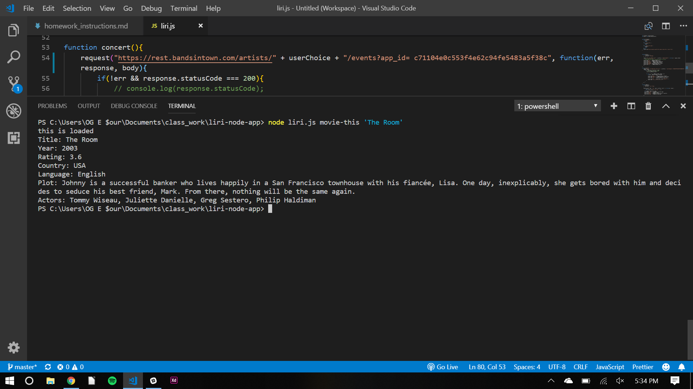

# liri-node-app

## LIRI will search Spotify for songs, Bands in Town for concerts, and OMDB for movies.

1. To search the omdb database the user must enter in command prompt: node liri.js movie-this 'userMovieTitle'   then press enter.

Format: 

1. To search the Band is in town database the user must enter in command prompt: node liri.js concert-this 'userBandName'   then press enter.

Format: 

1. To search the Spotify database the user must enter in command prompt: node liri.js spotify-this-song 'userArtistName'   then press enter.

Format: 